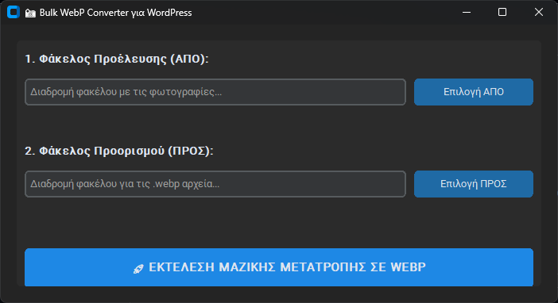

# Image Convert To Webp

Ένα σύγχρονο εργαλείο για Windows, κατασκευασμένο με .NET, που επιτρέπει τη μαζική μετατροπή εικόνων σε μορφή .Webp με ευκολία.

## Screenshot

## Χαρακτηριστικά
- **Μαζική Μετατροπή:** Μετατρέψτε ολόκληρους φακέλους με ένα κλικ.
- **Εύκολο UI:** Χρησιμοποιήστε τα κουμπιά για να επιλέξετε τον φάκελο προέλευσης και προορισμού.
- **Σύγχρονη Τεχνολογία:** Κατασκευασμένο με .NET για υψηλή απόδοση.

## Οδηγίες Χρήσης
1. Εκτελέστε το `Image Convert To Webp.exe`.
2. Πατήστε το **Επιλογή ΑΠΟ** για να επιλέξετε τον φάκελο με τις φωτογραφίες σας.
3. Πατήστε το **Επιλογή ΠΡΟΣ** για να επιλέξετε τον φάκελο αποθήκευσης.
4. Πατήστε **ΕΚΤΕΛΕΣΗ ΜΑΖΙΚΗΣ ΜΕΤΑΤΡΟΠΗΣ ΣΕ WEBP** για να ξεκινήσει η διαδικασία.

## Απαιτήσεις
- Windows 10 ή 11
- .NET Runtime (Latest)
